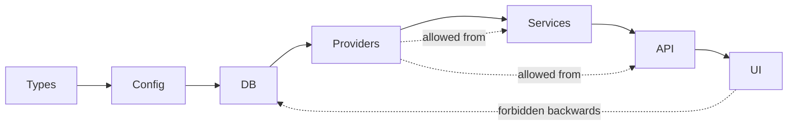

# ARCHITECTURE.md — top-level map

How the Clara (`etracker`) codebase is organised, the product domains, the
layers inside each domain, and the permitted vs forbidden edges between them.
Inspired by the
[matklad architecture.md pattern](https://matklad.github.io/2021/02/06/ARCHITECTURE.md.html).

For a specific feature, start at
[`knowledge/product-specs/index.md`](knowledge/product-specs/index.md).

## Domains

| Domain | What lives here | Primary skill |
|--------|-----------------|----------------|
| **Auth & Identity** | NextAuth v4 (JWT), Google sign-in, login/register, session helpers, MCP per-user PATs | TBD |
| **Months & Expenses** | Monthly templates, per-month copies, expense lines, paid/unpaid state, balance | TBD |
| **Banks** | Bank CRUD, multi-bank routing, default-bank logic, Runtime Cache | TBD |
| **AI Agent** | Vercel AI SDK chat agent, tools, prompts, multi-step tool loop, voice transcription/TTS | [`engineer-integrations`](.cursor/skills/engineer-integrations/SKILL.md), [`ux-writer`](.cursor/skills/ux-writer/SKILL.md) |
| **Imports** | PDF / image / CSV extraction, AI classifier, "always ask before changing" approval flow | [`engineer-integrations`](.cursor/skills/engineer-integrations/SKILL.md) |
| **Open Banking** | GoCardless Bank Account Data API, sync per month, transaction matching | [`engineer-integrations`](.cursor/skills/engineer-integrations/SKILL.md), [`legal-advisor`](.cursor/skills/legal-advisor/SKILL.md) |
| **WhatsApp** | Twilio inbound webhook, voice notes, link-code pairing, voice TTS replies | [`automated-user-comms`](.cursor/skills/automated-user-comms/SKILL.md) |
| **MCP Servers** | Public `/api/mcp` (docs as resources/tools) + per-user `/api/mcp/user` (PAT-authenticated tools) | [`engineer-integrations`](.cursor/skills/engineer-integrations/SKILL.md) |
| **SEO & Discovery** | Sitemaps, robots, JSON-LD, OG/Twitter, llms.txt, /.well-known/* | TBD |
| **Marketing** | Public landing, features, FAQ, changelog, privacy — all in `(marketing)/[lang]/`. Single source: `src/lib/marketing-content.ts` (ES + EN) | TBD |
| **Year Timeline** | Yearly view across months, Runtime Cache | TBD |
| **Settings** | Profile, AI tokens (MCP PATs), bank prefs, WhatsApp pairing | TBD |
| **Data Layer** | Prisma 7 + PostgreSQL 16, migrations, db client singleton | [`engineer-data`](.cursor/skills/engineer-data/SKILL.md) |
| **Platform** | i18n (es-AR / en), SEO, withApi() wrapper, log.ts, rate limiting | — |

## Layers inside a domain

Code only depends **forward** through layers. Cross-cutting concerns enter
through Providers. Anything else is disallowed.

| Layer | Where it lives | Examples |
|-------|----------------|----------|
| **Types / validators** | [`src/lib/validators.ts`](src/lib/validators.ts), Zod schemas inline in routes | `MonthIdSchema`, `ExpenseLineSchema` |
| **Config / env** | `.env.example`, env reads in providers | `DATABASE_URL`, `AI_MODEL`, `AI_GATEWAY_API_KEY` |
| **DB** | [`src/lib/db.ts`](src/lib/db.ts) (singleton) + Prisma client | `prisma.month.findMany(...)` |
| **Providers** | [`src/lib/ai/`](src/lib/ai), [`src/lib/revolut/`](src/lib/revolut), [`src/lib/whatsapp/`](src/lib/whatsapp), [`src/lib/blob/`](src/lib/blob), [`src/lib/cache/`](src/lib/cache) | AI Gateway client, GoCardless client, Twilio client, Vercel Blob, Runtime Cache |
| **Services** | Loose in `src/lib/*.ts` | `month-bucket.ts`, `month-page-data.ts`, `year-timeline-data.ts` |
| **API routes** | [`src/app/api/**/route.ts`](src/app/api) | Every handler wraps in `withApi()` from [`src/lib/http.ts`](src/lib/http.ts) |
| **MCP tools** | [`src/lib/mcp/`](src/lib/mcp) | Tools are thin wrappers around services, not duplicates of business logic |
| **UI** | [`src/app/(app)/`](src/app/(app)), [`src/components/`](src/components) | RSC + Server Actions where possible |

## Cross-cutting concerns (single entry point each)

| Concern | Entry point |
|---------|-------------|
| **Auth** | [`src/proxy.ts`](src/proxy.ts) middleware + [`src/lib/auth.ts`](src/lib/auth.ts) |
| **Errors** | [`src/lib/http.ts`](src/lib/http.ts) — `withApi()` wraps every route |
| **AI model selection** | [`src/lib/ai/`](src/lib/ai) — never bypass with direct `openai/*` calls for chat |
| **i18n** | [`src/lib/i18n/`](src/lib/i18n) — every user-facing string keyed |
| **SEO / structured data** | [`src/lib/seo.ts`](src/lib/seo.ts) — single helpers for metadata, JSON-LD, sitemaps |
| **Marketing copy + changelog** | [`src/lib/marketing-content.ts`](src/lib/marketing-content.ts) — ES + EN, single source |
| **Logging** | [`src/lib/log.ts`](src/lib/log.ts) — structured, Sentry-ready |
| **Rate limiting** | [`src/lib/rate-limit.ts`](src/lib/rate-limit.ts) + Upstash |

## Permitted vs forbidden edges

**Permitted:**

- Any layer may import from Types.
- Services may call Providers and DB.
- API routes may call Services, Providers, DB. Each handler must wrap its
  body in `withApi(...)`.
- MCP tools may call Services and DB but **never** duplicate business logic.
- UI may call API routes via fetch / Server Actions. UI must never import the
  Prisma client.

**Forbidden:**

- UI importing `src/lib/db.ts` or any Prisma type at the component level.
- API handlers doing `try { ... } catch { return NextResponse.json(...) }` —
  use `withApi()` and throw typed errors instead.
- Direct `openai.chat.completions.create(...)` calls for assistant chat /
  classification — must go through the AI Gateway client in `src/lib/ai/`.
- Code paths that write to a user's bank account or move money. Open Banking
  is read-only by design.
- Marketing copy or changelog entries duplicated outside
  `src/lib/marketing-content.ts`.

## Boundary validation (parse don't validate)

- Every API route parses input with Zod at the top.
- Every external provider response is normalised in its provider module
  (`src/lib/ai/`, `src/lib/revolut/`, etc.) before reaching services.
- Every WhatsApp / GoCardless webhook validates signature before doing work.

## Where to read next

- Per-feature: [`knowledge/product-specs/index.md`](knowledge/product-specs/index.md)
- Design principles: [`knowledge/design-docs/index.md`](knowledge/design-docs/index.md)
- Trefolio integration (sister project): trefolio's
  `knowledge/design-docs/etracker-clara-integration.md`
