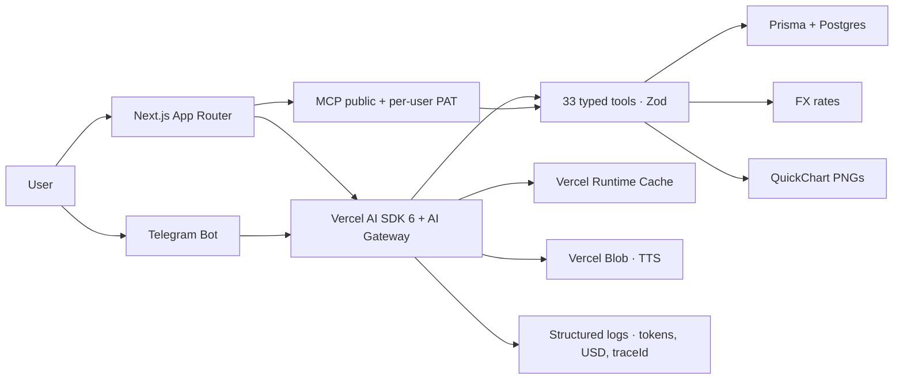

<div align="center">


# Clara AI Assistant

### Your money, finally clear.

**Open-source, chat-first personal finance with AI — rioplatense Spanish by default, English supported.** Send a bank screenshot, a PDF, or a voice note on Telegram: Clara extracts movements, suggests categories, and keeps your monthly balance honest.

[](./LICENSE)
[](https://github.com/kyberis/etracker/stargazers)

**[Live demo](https://clara.trefolio.com)** · **[README (ES)](./README.md)** · **[Contributing](./CONTRIBUTING.md)**

</div>

## Two messages

> **You:** I paid rent today, $850
>
> **Clara:** Done — **Rent** is marked paid for April. You have **$1,240** left for pending expenses this month.
>
> **You:** _[attach a bank PDF]_
>
> **Clara:** Parsed. I found 14 movements; 9 matched planned lines and I marked them paid. **5 look new** — review the proposal and confirm what you want saved.

## MCP for your own AI

Clara exposes **Model Context Protocol** servers:

- **Public** — `https://clara.trefolio.com/api/mcp` — product docs, FAQ, changelog (use `?lang=en` or `Accept-Language`).
- **Per-user** — `https://clara.trefolio.com/api/mcp/user` — bearer token from **Settings → AI access**. Legacy `ada_pat_*` tokens still verify; new tokens use `clara_pat_*`.

```json
{
  "mcpServers": {
    "clara": {
      "url": "https://clara.trefolio.com/api/mcp/user",
      "headers": { "Authorization": "Bearer clara_pat_..." }
    }
  }
}
```

## Screenshots

PNG placeholders (1280×800) live under [`public/screenshots/`](./public/screenshots/). Swap them for real captures from the hosted app when you want pixel-perfect marketing.

## Architecture (Mermaid)

Same diagram as the Spanish README — render on GitHub or any Mermaid viewer:



## What makes Clara technically interesting

- **Typed tools → Prisma** — no fragile string parsing of model output; Zod schemas and a bounded step count keep the agent honest.
- **MCP with guardrails** — per-user rate limits, hashed PATs, and `confirm: true` on destructive tools mirror the web chat UX.
- **Multimodal + observability** — PDFs, images, and Telegram voice share one pipeline; JSON logs include `traceId`, token usage and estimated USD for AI Gateway cost tags.

## Quick start

```bash
git clone https://github.com/kyberis/etracker.git
cd etracker
npm install
cp .env.example .env
# Fill DATABASE_URL, NEXTAUTH_URL, NEXTAUTH_SECRET
docker compose up -d
npm run prisma:migrate
npm run dev
```

Full environment variables, deploy notes, SEO details, and the roadmap live in the **[Spanish README](./README.md)** (the canonical maintainer doc). This file exists so LinkedIn / HN traffic that prefers English still lands on something useful.

## Licence

[MIT](./LICENSE)

Made by [trefolio.com](https://trefolio.com)
