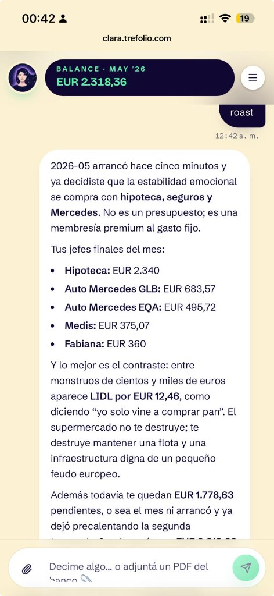
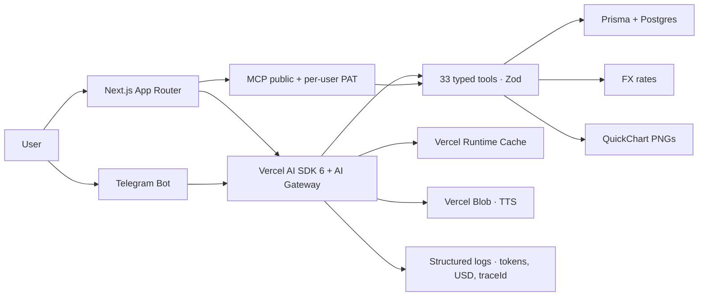

<div align="center">


# Clara Lovelace

### Tu plata, finalmente clara.

**Asistente financiera con IA, open source y rioplatense.** Mandale una foto del banco, un PDF, una nota de voz por Telegram — Clara extrae los movimientos, sugiere categorías y mantiene tu balance al día.

[](#-licencia)
[](https://github.com/kyberis/etracker/stargazers)
[](https://nextjs.org)
[](https://react.dev)
[](https://www.typescriptlang.org)
[](https://www.prisma.io)
[](https://tailwindcss.com)
[](https://vercel.com/ai-gateway)
[](.github/workflows/ci.yml)
[](#-contributing)

**[Live demo](https://clara.trefolio.com) · [Quick start](#-quick-start) · [Features](#-una-asistente-no-una-planilla) · [MCP](#-tu-propio-ai-puede-hablar-con-clara-mcp) · [English README](./README.en.md) · [Contributing](#-contributing)**

</div>

> ### ⭐ Si te gusta lo que ves, dale una star.
>
> Clara es 100% open source y se mantiene **a pulmón**, sin VC ni planes pagos. Una star en GitHub es gratis, tarda dos segundos y nos avisa que vale la pena seguir construyendo en abierto. **[Star Clara acá](https://github.com/kyberis/etracker)** — gracias 🙏.

---

## 💬 Esto es Clara en dos mensajes

> **Vos:** Pagué el alquiler hoy, $850
>
> **Clara:** Listo, marqué **Alquiler** como pagado en abril ✅. Te quedan **$1.240** para los gastos pendientes del mes.
>
> **Vos:** _\[adjuntás un PDF del banco\]_
>
> **Clara:** Dale, ya lo procesé. Te encontré 14 movimientos, 9 ya estaban planificados y los marqué como pagados. Quedan **5 gastos nuevos** — mirá la propuesta y confirmá los que quieras registrar.

Sin filas infinitas. Sin categorías que tildás manualmente. Sin abrir la app.

## ✨ ¿Por qué otra app de finanzas?

La mayoría son lo mismo de siempre:

- 🪦 **Planillas con mejor diseño** — filas, categorías, reportes. Bonitas las primeras dos semanas; muertas al segundo mes.
- 🔒 **Jardines cerrados** — tus datos viven en la base de datos de otra empresa, pagás todos los meses, y las features de IA son un upsell de $9.99.

**Clara es chat-first, open source y self-hosteable.** Hablás con tu plata en lenguaje normal, le tirás un PDF y entiende, le mandás una nota de voz y registra el gasto. La IA es **el núcleo del producto**, no una etiqueta de marketing.

> Clara habla **español rioplatense** y soporta inglés neutro de fábrica (DB column `User.locale`, dictionaries `es`/`en`, system prompt bilingüe). Para sumar otro dialecto el cambio es chico: ver `src/lib/ai/run-expense-agent.ts` y `src/lib/i18n/dictionaries/`. PRs bienvenidos. 🌎

## 🎯 Una asistente, no una planilla

Cada feature está pensada para que entiendas tu plata sin abrir Excel — y para que tu propio AI assistant pueda ayudarte sin pedirte permiso quince veces.

| | |
|---|---|
| 🤖 **Lee tus extractos** | Tirá una captura del banco, un PDF o un CSV. Clara extrae los movimientos, sugiere categorías y siempre pregunta antes de tocar nada. |
| 🎙️ **Escucha notas de voz** | "Pagué el alquiler" por Telegram es suficiente. Clara transcribe, clasifica y actualiza el mes sin que abras la app. |
| 📅 **Organizada por mes** | Una plantilla define un gasto recurrente. Cada mes tiene su copia independiente que tildás cuando lo pagás. |
| 🏦 **Multi-banco real** | Cada gasto sabe en qué banco vive. Útil cuando repartís el alquiler entre tres cuentas y querés saber cuánto te queda en cada una. |
| 📊 **Visualiza solo cuando ayuda** | Clara no tira gráficos por tirar. Los renderiza inline solo cuando suman para entender lo que está pasando. |
| 💬 **Habla rioplatense e inglés** | Sin inglés corporativo ni tuteo en español; inglés neutro cuando el usuario está en `en`. Clara habla como una amiga contadora que sabe lo que hace — sin sermones, prometido. |
| 🔓 **Tu data es tuya** | Open source MIT. Self-hosteable en cualquier Vercel/Postgres. Sin telemetría, sin tracking, sin upsell de IA a $9.99/mes. |
| 🤝 **MCP para tu AI** | Clara expone un servidor MCP. Conectalo a Claude Desktop, Cursor o ChatGPT y tu propio asistente puede consultar y actualizar tus finanzas con tu permiso. |

## 🤝 Tu propio AI puede hablar con Clara (MCP)

Clara expone un servidor **MCP (Model Context Protocol)**. Generás un token desde **Settings → Acceso para AI** y lo pegás en Claude Desktop, Cursor o cualquier cliente compatible: tu asistente consulta tus meses, mira el balance y registra gastos con tu permiso.

```json
{
  "mcpServers": {
    "clara": {
      "url": "https://clara.trefolio.com/api/mcp/user",
      "headers": { "Authorization": "Bearer clara_pat_..." }
    }
  }
}
```

Tools disponibles: `getProfile`, `listBanks`, `listExpenseTemplates`, `listMonths`, `getMonth`, `getCurrentBalance`, `getYearTimeline`, `addExpenseTemplate`, `addExpenseToMonth`, `markLinePaid`, `deleteLine`, `createBank`. Discovery: `/.well-known/mcp.json`. Tokens hasheados con sha-256, expirables y revocables desde Settings.

> Tokens viejos con prefijo `ada_pat_` (de la versión previa al rebrand) siguen funcionando — el verificador acepta ambos prefijos.

> Si esta combinación (MCP + finanzas + open source) te resulta interesante, **[dejá una star](https://github.com/kyberis/etracker)** así más gente la descubre.


## 🖼️ Screenshots

<table>
<tr>
<td width="33%" align="center">

<br/><strong>Web chat</strong> — anotá un gasto, pedí un roast o adjuntá un PDF
</td>
<td width="33%" align="center">

<br/><strong>Roast</strong> — Clara con la verdad financiera sin filtro
</td>
<td width="33%" align="center">

<br/><strong>Telegram</strong> — chat con gráficos inline cuando suman
</td>
</tr>
</table>

## 🚀 Quick start

```bash
# 1. Clonar e instalar
git clone https://github.com/kyberis/etracker.git
cd etracker
npm install

# 2. Configurar entorno
cp .env.example .env
# Completar DATABASE_URL, NEXTAUTH_URL, NEXTAUTH_SECRET (el resto es opcional)

# 3. Levantar Postgres
docker compose up -d

# 4. Correr migraciones
npm run prisma:migrate

# 5. Iniciar la app
npm run dev
```

Abrí <http://localhost:3000> y creá tu cuenta.

> 💡 **¿Sin Docker?** Cualquier Postgres 14+ funciona. Apuntá `DATABASE_URL` a él.

## 🧱 Tech stack

- **Next.js 16** (App Router, RSC, Turbopack) · **React 19** · **TypeScript 5**
- **Tailwind CSS 4** · **shadcn/ui** · **Lucide icons**
- **NextAuth v4** (estrategia JWT + adaptador Prisma)
- **Prisma 7** · **PostgreSQL 16**
- **Vercel AI SDK 6** enrutado vía **Vercel AI Gateway** (multi-proveedor, failover, tracking de costos)
- **Vercel Blob** (audio TTS) · **Vercel Runtime Cache** (bancos, timeline anual)
- **Upstash Redis** (rate limiting)
- **Telegram Bot API** (canal conversacional)
- **Vitest** (unit tests) · **GitHub Actions** (CI)

## 🏗️ Architecture



El wrapper centralizado `withApi()` en [`src/lib/http.ts`](src/lib/http.ts) maneja errores Zod, errores Prisma y códigos de negocio (`UNAUTHORIZED`, …) para que los route handlers sean pequeños y consistentes.

## 🧠 Qué hace a Clara Lovelace técnicamente interesante

- **Agente real con tool-calling, sin parseo de strings** — tools tipadas con Zod ejecutan directo contra Prisma; el modelo planifica, llama tools (incl. `addMonthLines` para extractos) y para bajo un presupuesto fijo de pasos (`stopWhen: stepCountIs(24)` en [`src/lib/ai/run-expense-agent.ts`](src/lib/ai/run-expense-agent.ts)).
- **MCP como superficie de primera clase** — discovery público en `/api/mcp` más un servidor por usuario en `/api/mcp/user` con auth PAT, paridad destructiva (`confirm: true`), y rate limits por usuario para que una clave filtrada no queme tu cuota en silencio.
- **Multimodal de producción** — PDFs, capturas de banco y notas de voz de Telegram comparten un pipeline de extracción; los logs JSON estructurados llevan `traceId`, tokens y USD estimado por paso para atribuir costos vía AI Gateway tags.

## 📁 Estructura del repo

```
src/
  app/                 Next.js App Router
    (app)/             Shell autenticado (bancos, meses, configuración…)
    (auth)/            UI de login / registro
    (marketing)/       Landing pública, features, FAQ, changelog, privacy
    api/               Handlers REST — todos usan withApi()
  components/
    month/             Subcomponentes que componen <MonthDashboard />
    ui/                Primitivos shadcn
  lib/
    ai/                Agente, herramientas, transcripción, TTS
    cache/             Wrappers de Vercel Runtime Cache (bancos)
    blob/              Helpers de Vercel Blob (TTS)
    telegram/          Cliente Bot API + helpers de link-code
    http.ts            Wrapper withApi() usado por cada route handler
    log.ts             Helper de log estructurado (listo para Sentry)
prisma/                Schema + migraciones
public/                Assets estáticos (sw.js, iconos, manifests…)
.github/workflows/     CI (lint, typecheck, test, build)
```

## ⚙️ Configuración

### Variables de entorno (lista completa en [`.env.example`](./.env.example))

<details>
<summary><strong>Core</strong> (requeridas)</summary>

| Variable          | Notas                                                                |
| ----------------- | -------------------------------------------------------------------- |
| `DATABASE_URL`    | Cadena de conexión PostgreSQL. Usá la URL pooled en Neon / Vercel.   |
| `NEXTAUTH_URL`    | URL pública (ej. `http://localhost:3000`).                           |
| `NEXTAUTH_SECRET` | `openssl rand -base64 32`                                            |

</details>

<details>
<summary><strong>IA</strong> (Vercel AI Gateway, recomendado)</summary>

| Variable               | Descripción                                                         |
| ---------------------- | ------------------------------------------------------------------- |
| `VERCEL_OIDC_TOKEN`    | Auto-provisionado por `vercel env pull` (preferido en Vercel).      |
| `AI_GATEWAY_API_KEY`   | Fallback para CI runners y dev local fuera de `vercel`.             |
| `AI_MODEL`             | Override del modelo de chat (default `openai/gpt-5.4`). Formato `provider/model`. |
| `OPENAI_API_KEY`       | Requerido para TTS y transcripción Whisper.                         |

```bash
vercel link
vercel env pull .env.local   # trae VERCEL_OIDC_TOKEN; rotar cada ~12h
```

</details>

<details>
<summary><strong>Integraciones opcionales</strong></summary>

| Grupo              | Variables                                                                |
| ------------------ | ------------------------------------------------------------------------ |
| Google sign-in     | `GOOGLE_CLIENT_ID`, `GOOGLE_CLIENT_SECRET`                               |
| Telegram           | `TELEGRAM_BOT_TOKEN`, `TELEGRAM_BOT_USERNAME`, `TELEGRAM_WEBHOOK_SECRET`, `TELEGRAM_LINK_TOKEN_SECRET` |
| Gráficos en chat   | `CLARA_OUTBOUND_CHART_IMAGES` (`0` para desactivar), `CLARA_QUICKCHART_BASE_URL` (QuickChart self-hosted, opcional) |
| Storage TTS        | `BLOB_READ_WRITE_TOKEN` (Vercel Blob)                                    |
| Rate limits        | `UPSTASH_REDIS_REST_URL`, `UPSTASH_REDIS_REST_TOKEN`                     |
| Sentry             | `SENTRY_DSN` (reenvía `log.error(...)` si `@sentry/nextjs` está instalado)|

</details>

## 🧪 Scripts

| Script                    | Descripción                                          |
| ------------------------- | ---------------------------------------------------- |
| `npm run dev`             | Iniciar servidor de desarrollo (Turbopack)           |
| `npm run build`           | Build de producción                                  |
| `npm run start`           | Iniciar servidor de producción                       |
| `npm run lint`            | ESLint                                               |
| `npm test`                | Correr suite Vitest una vez                          |
| `npm run test:watch`      | Vitest en modo watch                                 |
| `npm run format`          | Prettier                                             |
| `npm run prisma:migrate`  | Migración de desarrollo                              |
| `npm run prisma:deploy`   | Aplicar migraciones en producción                    |

## 🔌 MCP — endpoints públicos

Clara expone dos servidores MCP que cualquier cliente compatible puede consumir.

### Público — `/api/mcp`

Sin auth. Expone documentación de Clara (features, FAQ, changelog, privacy) como resources, tools y prompts. Útil para que tu asistente AI pueda responder preguntas sobre el producto. Acepta `?lang=es|en` (o `Accept-Language`) para devolver el contenido en el idioma elegido.

```json
{
  "mcpServers": {
    "clara": { "url": "https://clara.trefolio.com/api/mcp" }
  }
}
```

### Per-user — `/api/mcp/user`

Autenticado con bearer token. Cada usuario genera un token desde **Settings → Acceso para AI (MCP)** y lo pega en su cliente MCP. Ver [sección anterior](#-tu-propio-ai-puede-hablar-con-clara-mcp) para el snippet de configuración y la lista de tools.

## 🔍 SEO + AI SEO

Clara está optimizada para search engines tradicionales **y** crawlers de IA (ChatGPT, Claude, Perplexity, Gemini):

- **Sitemap** dinámico en `/sitemap.xml` con `hreflang` es-AR / es.
- **robots.txt** con políticas explícitas para `GPTBot`, `OAI-SearchBot`, `ChatGPT-User`, `ClaudeBot`, `Claude-Web`, `anthropic-ai`, `PerplexityBot`, `Google-Extended`, `Applebot-Extended`, `Amazonbot`, `Bytespider`, `CCBot`, `Meta-ExternalAgent`, `MistralAI-User`, etc.
- **JSON-LD** en cada página: `Organization`, `WebSite` (con `SearchAction`), `SoftwareApplication`, `FAQPage`, `BreadcrumbList`, `Article` (changelog).
- **OpenGraph + Twitter Card** dinámicos vía `next/og` (`/opengraph-image`, `/twitter-image`).
- **`/llms.txt`** (formato [llmstxt.org](https://llmstxt.org)) + **`/llms-full.txt`** (dump markdown completo) para descubrimiento por LLMs.
- **`/.well-known/{mcp.json,ai-plugin.json,security.txt}`** y **`/openapi.json`** para descubrimiento por agentes.
- Marcado HTML semántico con `<html lang="es-AR">`, `<article>`/`<section>`/`<dl>` jerárquicos, `metadataBase`, canonical URLs.

## ☁️ Deploy

### Vercel + Neon (friendly para un click)

1. **Crear un Neon Postgres** (o cualquier Postgres administrado). Usar la cadena de conexión **pooled** para `DATABASE_URL`.
2. **Configurar vars de entorno** en Vercel — mínimo `DATABASE_URL`, `NEXTAUTH_URL`, `NEXTAUTH_SECRET`.
3. **`vercel link`** el proyecto localmente para que `VERCEL_OIDC_TOKEN` sea provisionado para las features de IA.
4. **Deployar**. Los deploys de producción corren `prisma migrate deploy` automáticamente (guardado por `VERCEL_ENV` en [`vercel.json`](./vercel.json)). Los deploys de preview nunca tocan la base de datos.

### Self-host

Clara es una app vanilla Next.js + Postgres. Corre en **cualquier cosa** que pueda correr Node 22 + Postgres 14+:

- Docker / docker-compose (se incluye un [`docker-compose.yml`](./docker-compose.yml) de inicio para la base de datos)
- Fly.io, Railway, Render, Coolify, Dokku
- Tu propio VPS

Las integraciones opcionales (Vercel AI Gateway, Blob, Runtime Cache) todas degradan gracefully — sin ellas, la app igual funciona, solo sin features de IA / lookups cacheados.

## 💡 Sobre Clara Lovelace

El nombre es un homenaje doble: a la idea de **claridad** — el objetivo del producto es que tu plata _quede clara_ — y a **Ada Lovelace**, matemática del siglo XIX que escribió el primer algoritmo de la historia, décadas antes de que existiera una computadora capaz de ejecutarlo. Ella entendió que las máquinas podían hacer más que calcular: podían razonar.

Clara Lovelace nace del mismo espíritu: que la inteligencia, bien aplicada, transforma datos crudos en decisiones claras. Tus extractos bancarios son solo números — Clara los convierte en un panorama de tu vida financiera.

Construida por el equipo detrás de [trefolio.com](https://trefolio.com).

## 🤝 Contributing

Las contribuciones son **muy bienvenidas** — leé [CONTRIBUTING.md](./CONTRIBUTING.md) y el [Código de conducta](./CODE_OF_CONDUCT.md). En resumen:

- 🌍 **Traducciones** — los prompts del asistente y el copy de la UI están en español rioplatense; inglés / otros dialectos serían enormes.
- 📊 **Más tipos de gráficos** en el asistente.
- 🐛 **Reportes de bugs** con pasos para reproducir.
- ⭐ **Una star** si este proyecto te ahorró una noche.

### Loop de desarrollo

```bash
npm install
npm run prisma:migrate
npm run dev          # en una terminal
npm run test:watch   # en otra
```

Antes de abrir un PR:

```bash
npm run lint
npx tsc --noEmit
npm test
npm run build
```

CI corre los mismos gates en cada PR ([`.github/workflows/ci.yml`](.github/workflows/ci.yml)).

### Estilo de código

- **TypeScript en todo.** Sin `any` a menos que puedas defenderlo.
- **Centralizar errores vía `withApi()`.** No hagas catch+rethrow en los handlers.
- **Los comentarios explican el _por qué_, no el _qué_.** El código ya dice qué.
- **Tests para funciones puras.** Cualquier cosa en `src/lib/**/*.ts` que no toque la DB debería tener un unit test.

## 🗺️ Roadmap

- [x] UI en inglés / multi-locale (base: `User.locale`, diccionarios `es`/`en`, prompts del agente)
- [ ] Importación CSV / OFX desde el banco
- [ ] Presupuestos y alertas
- [ ] Multi-moneda (display + conversión)
- [ ] Captura de voz nativa en mobile
- [x] Landing pública + demo ([clara.trefolio.com](https://clara.trefolio.com))

¿Tenés una idea? [Abrí un issue](https://github.com/kyberis/etracker/issues/new) — incluso las a medio formar son útiles.

## 🔐 Notas de auth

- La estrategia es `jwt` (NextAuth `session.strategy === "jwt"`). Las tablas `Session` y `VerificationToken` son eliminadas por la migración `20260428220000_drop_unused_authjs_tables` porque nunca se leen con esta estrategia.
- El adaptador Prisma se **mantiene** porque persiste las filas `User` y `Account` en el primer Google sign-in.
- Google sign-in es **denegación por defecto** cuando `email_verified` no es explícitamente `true`.

## 💾 Capas de caché

- **Vercel Runtime Cache** ([`src/lib/cache/banks.ts`](src/lib/cache/banks.ts)) — lista de bancos por usuario, eviccionada por tag en crear / actualizar / eliminar.
- **Vercel Runtime Cache** ([`src/lib/year-timeline-data.ts`](src/lib/year-timeline-data.ts)) — timeline anual por usuario/año, eviccionado desde cualquier handler que mute un mes.

Ambos hacen fallthrough a queries directas a la DB cuando corren fuera de una función Vercel.

## 🙏 Créditos

Parado sobre los hombros de gigantes:

- [Next.js](https://nextjs.org) · [React](https://react.dev) · [Vercel](https://vercel.com) · [Vercel AI SDK](https://sdk.vercel.ai)
- [Prisma](https://www.prisma.io) · [PostgreSQL](https://www.postgresql.org)
- [Tailwind CSS](https://tailwindcss.com) · [shadcn/ui](https://ui.shadcn.com) · [Lucide](https://lucide.dev) · [Base UI](https://base-ui.com)
- [NextAuth.js](https://next-auth.js.org) · [Zod](https://zod.dev)
- [Telegram Bot API](https://core.telegram.org/bots/api) · [OpenAI](https://openai.com)
- [Upstash](https://upstash.com) · [Vitest](https://vitest.dev)

## 📄 Licencia

[MIT](./LICENSE) — hacé lo que quieras, solo no nos culpes si tu contador se enoja.

---

<div align="center">

### ¿Te sirvió Clara?

**[⭐ Dale una star en GitHub](https://github.com/kyberis/etracker)** — es la forma más barata de apoyar el proyecto.

**[🐦 Contale a alguien](https://twitter.com/intent/tweet?text=Conocé%20Clara%20—%20asistente%20financiera%20open-source%20con%20IA&url=https%3A%2F%2Fgithub.com%2Fkyberis%2Fetracker)** · **[🐛 Reportar un bug](https://github.com/kyberis/etracker/issues/new)** · **[💬 Abrir una idea](https://github.com/kyberis/etracker/discussions)**

_Hecho con ☕ y una sana desconfianza de las planillas._

Made by [trefolio.com](https://trefolio.com)

</div>
