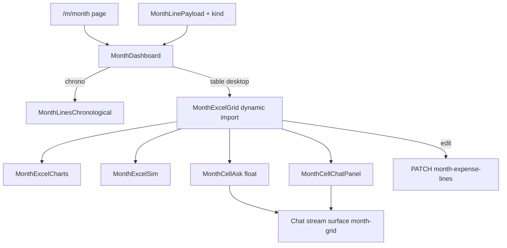

# month-desktop-grid — plan de implementación

Repo: **`kyberis/etracker`** (`external/etracker` en trefolio).  
Specs: [`knowledge/product-specs/month-desktop-grid.md`](../../product-specs/month-desktop-grid.md)  
Mockup: [`.cursor/mockups/month-excel-grid.html`](../../../.cursor/mockups/month-excel-grid.html)  
Datos base: [`months-and-templates.md`](../../product-specs/months-and-templates.md)

No tocar el pin de trefolio hasta que este plan esté en `completed/` y
desplegado en Clara.

---

## Objetivo

En `/m/[month]` (desktop ≥1100px), el usuario puede:

1. Alternar **Cronológico ↔ Tabla**.
2. En Tabla: ver gastos agrupados por banco, filtrar recurrente/puntual, KPIs.
3. **Click** celda/KPI → input flotante → pregunta → Clara responde a la derecha.
4. **Doble click** → editar y persistir (name, category, paid, amount).
5. Modos **Gráficos** (4 charts) y **Simular** (qué pasa si saco/bajo un gasto)
   sin persistir la simulación.

Mobile / &lt;1100px: sin grilla; cronológico actual sin regresiones.

---

## Decisiones (cerradas para v1)

| Tema | Decisión |
|------|----------|
| Badge Recurrente/Puntual | **Read-only** en v1. Derivar `kind` del template. Editar tipo = v1.1 |
| `kind` | `RECURRING` si `templateId && template.isRecurring`; else `ONE_OFF` |
| Charts | **Recharts** (ya en `package.json`) |
| Feature flag | `NEXT_PUBLIC_MONTH_DESKTOP_GRID=1` (off por defecto en prod hasta QA) |
| Preferencia vista | `localStorage` key `clara.monthView` = `table` \| `chrono` (solo si desktop + flag) |
| Simulación | Estado cliente + `sessionStorage` keyed por `userId:month`; **nunca** PATCH |
| Cell ask UI | Panel **aislado** a la derecha (no mezcla hilo con chat global del layout) |
| Cell ask backend | Reusar stream de chat web con `surface: "month-grid"` + snapshot contexto |
| Edición monto | Editar `amount` en `currency` de la línea; `amountConverted` vía `fxRate` congelado (mismo contrato que `MonthLineEditDialog` / PATCH actual) |
| Filtro tabla | Solo afecta filas de la tabla; charts/sim usan mes completo |
| Virtualización | Solo si &gt;100 líneas (fase qa o follow-up si hace falta) |
| Delivery preset | `ALIMENTACION` + nombre `/pedidosya|pedidos\s*ya|rappi|delivery|uber\s*eats/i` |

Cualquier cambio a esta tabla se anota en el todo `decide-lock` y en el PRD §16.

---

## Arquitectura



### Archivos nuevos (propuestos)

| Path | Rol |
|------|-----|
| `src/lib/month-line-kind.ts` | `resolveMonthLineKind(line)` |
| `src/lib/month-line-kind.test.ts` | Unit |
| `src/lib/month-sim.ts` | effectiveAmount, presets, aggregates helpers |
| `src/lib/month-sim.test.ts` | Unit |
| `src/lib/month-aggregates.ts` | byBank / byCategory / byKind / topN |
| `src/lib/month-aggregates.test.ts` | Unit |
| `src/lib/ai/cell-ask-context.ts` | Snapshot + prompt fragments |
| `src/lib/ai/cell-ask-context.test.ts` | Unit |
| `src/components/month/month-excel-grid.tsx` | Shell Tabla/Gráficos/Simular + KPIs |
| `src/components/month/month-excel-table.tsx` | Tabla agrupada |
| `src/components/month/month-excel-charts.tsx` | 4 Recharts |
| `src/components/month/month-excel-sim.tsx` | Lista sim |
| `src/components/month/month-cell-ask.tsx` | Float input |
| `src/components/month/month-cell-chat-panel.tsx` | Hilo contextual |

### Archivos a tocar

| Path | Cambio |
|------|--------|
| `src/lib/month-page-types.ts` | `kind`, `templateId` en `MonthLinePayload` |
| `src/lib/month-page-data.ts` | Include template; mapear campos |
| `src/components/month-dashboard.tsx` | Toggle + conditional render + dynamic import |
| `src/lib/i18n/dictionaries/es.ts` / `en.ts` | Strings UI |
| Chat stream route / client | Aceptar `surface` + `cellAskContext` |
| `src/lib/ai/run-expense-agent.ts` | Bloque prompt si `surface === "month-grid"` |
| `src/lib/marketing-content.ts` | CHANGELOG |
| `.cursor/mockups/month-excel-grid.html` | Comentario “implemented → spec” |
| `knowledge/product-specs/month-desktop-grid.md` | Cerrar gaps §16 |

---

## Fases y orden de trabajo

### Fase 0 — Foundation (todo: `decide-lock`, `dto-kind`, `sim-lib`)

1. Confirmar decisiones de la tabla arriba.
2. Prisma query en `getMonthPageData` / `month-page-data`: `lines` include
   `template: { select: { id, isRecurring } }`.
3. Ampliar DTO:

```ts
templateId: string | null;
kind: "RECURRING" | "ONE_OFF";
```

4. Tests de kind + sim + aggregates **antes** de UI (TDD liviano).

**DoD fase 0:** types compilan; tests unit verdes; payload JSON del mes trae
`kind` correcto en un mes seed (manual o test de mapper).

### Fase 1 — Shell + Tabla read-only (`flag-toggle-shell`, `ui-table`)

1. `const enabled = process.env.NEXT_PUBLIC_MONTH_DESKTOP_GRID === "1"`.
2. Hook `useMediaQuery("(min-width: 1100px)")`.
3. Si `enabled && desktop`: mostrar tabs/toggle Tabla | Cronológico junto al
   header del mes.
4. `next/dynamic(() => import("./month/month-excel-grid"), { ssr: false })`.
5. Implementar tabla:
   - groupBy `bankId`, orden = orden de `data.bankTotals`.
   - columnas Fecha | Concepto | Categoría | Tipo | Pagado | Monto.
   - badges lime/peach.
   - collapse por banco.
   - filtros Todos / Recurrentes / Puntuales (solo tabla).
   - KPI strip + tip banner determinístico (PRD §5.10).
6. i18n todas las strings.

**DoD fase 1:** con flag on, desktop ve paridad razonable con mockup (sin chat
ni edit ni sim); mobile sin toggle; chrono default.

### Fase 2 — Edición (`ui-edit`)

1. Reutilizar contrato PATCH de
   `src/app/api/month-expense-lines/[id]/route.ts` (mismo que
   `MonthLineEditDialog`).
2. Campos: `name`, `category`, `paid`, `amount` (+ currency display hint).
3. Optimistic update del state `expenses` en `MonthDashboard` (pasar setters o
   callbacks `onLinePatched`).
4. Toast éxito/error; Esc cancela edit.
5. Single-click delay 220ms cancelado por dblclick.

**DoD fase 2:** editar nombre y monto en UI persiste y sobrevive refresh;
`occurredOn` no editable desde grid.

### Fase 3 — Charts + Sim (`ui-charts`, `ui-sim`)

1. Mode tabs dentro del grid: Tabla | Gráficos | Simular.
2. Recharts 2×2; colores categorías/bancos alineados a tokens Clara.
3. Sim state: `Record<lineId, { included: boolean; cutPct: number }>`.
4. `effectiveAmountConverted(line, sim)` alimenta KPIs, charts y montos de
   tabla (“era $X” si difiere).
5. Presets Reset + Sin delivery.
6. Debounce 50–100ms en slider → chart update.

**DoD fase 3:** desmarcar delivery baja KPI y actualiza charts; Reset restaura;
Network tab sin PATCH al simular.

### Fase 4 — Cell ask (`cell-ask`)

1. Float UI (mockup): chip contexto, textarea, hints, Esc/click-outside.
2. Panel derecho solo en sub-modo Tabla (en Gráficos/Sim el panel puede
   ocultarse o mostrar empty — **decisión:** ocultar panel en Gráficos/Sim
   para ganar ancho; chat solo en Tabla).
3. `buildCellAskContext({ month, focus, lines, primaryCurrency })`.
4. Prompt: números y patrones; prohibido consejo financiero (ux-writer +
   automated-user-comms).
5. Stream tokens al panel; errores 429 → mismo upsell que chat.
6. Cuota: misma que chat web.

**DoD fase 4:** click en Netflix → pregunta “¿es mucho?” → respuesta menciona
monto y categoría reales; no inventa líneas.

### Fase 5 — Hardening (`legal-a11y`, `changelog-spec`, `qa-ship`)

1. `legal-advisor` skill (AI + datos financieros en nuevo surface).
2. a11y: `role="dialog"` float, `aria-expanded` grupos, contraste badges.
3. CHANGELOG minor ES+EN.
4. Cerrar §16 del PRD; mockup header comment → spec implemented.
5. QA checklist PRD §11.4; `npm run lint && npx tsc --noEmit && npm test && npm run build`.
6. Flag on en preview Vercel; prod flag off hasta sign-off.
7. Mover plan a `knowledge/exec-plans/completed/`.

---

## Contratos clave

### Lectura

Sin endpoint nuevo. Enriquecer mapper existente en
[`src/lib/month-page-data.ts`](../../../src/lib/month-page-data.ts).

### Escritura

Reusar PATCH/DELETE existentes de month expense lines. No nuevo schema salvo
que falte algún campo ya soportado por el dialog de edición.

### Cell ask

Extender el client del chat (localizar ruta exacta al implementar — buscar
`useChat` / `/api/chat`) con body extra:

```ts
{
  surface: "month-grid",
  cellAsk: {
    month: string;
    focus: { type: "line"; lineId: string; field?: string }
      | { type: "bank"; bankId: string }
      | { type: "kpi"; kpi: "total" | "recurring" | "oneoff" | "banks" };
    snapshot: { /* montos primaryCurrency, kind, bankName, category */ };
  }
}
```

El historial de ese panel es **local al componente** (no se mezcla con el
drawer/chat global).

---

## Invariantes (tests / code review)

1. Simulación → 0 requests de mutación.
2. Sumas solo con `amountConverted` (o effective derivado de ese).
3. Grid no se monta si `!flag || !desktop`.
4. Cell ask consume cuota.
5. Cronológico bit-identical en comportamiento cuando vista = chrono.
6. Clara no inventa IDs de líneas fuera del snapshot.

---

## i18n (mínimo)

Keys bajo `monthGrid.*` en `es.ts` / `en.ts`:

- tabs, filtros, columnas, badges, KPIs, tips, sim banner, presets, float
  placeholder/hints, empty chat, toasts edit, mobile N/A (no UI).

ES: voseo rioplatense. EN: fiel, sin slang forzado.

---

## Testing (mínimo CI)

| Archivo | Cobertura |
|---------|-----------|
| `month-line-kind.test.ts` | template recurrente / puntual / null |
| `month-sim.test.ts` | cut %, excluded, preset delivery, reset, saved |
| `month-aggregates.test.ts` | topN, byCat, byBank, byKind |
| `cell-ask-context.test.ts` | shape + no leak campos de más |

Component tests opcionales v1 si el tiempo aprieta; **must** unit + QA manual.

---

## Riesgos

| Riesgo | Mitigación |
|--------|------------|
| Pelea click/dblclick | delay 220ms + cancel |
| Usuario cree que Sim borra | copy + zero writes |
| Cuota quemada por curiosidad | respuestas cortas; hints |
| Bundle charts en mobile | dynamic import solo al elegir Tabla |
| Prompt “aconseja” | system block explícito + legal pass |

---

## Estimación

| Fase | Días |
|------|------|
| 0 Foundation | 0.5–1 |
| 1 Tabla RO | 1–2 |
| 2 Edit | 1 |
| 3 Charts+Sim | 1–2 |
| 4 Cell ask | 1–2 |
| 5 Hardening | 1 |
| **Total** | **~5–8** |

---

## Definition of Done (ship)

- [ ] Flag on en preview; checklist QA §11.4 OK
- [ ] Unit tests verdes en CI
- [ ] Lint + tsc + build OK
- [ ] Legal-advisor anotado
- [ ] CHANGELOG ES+EN
- [ ] PRD gaps cerrados; mockup linkeado como implementado
- [ ] Este plan movido a `completed/`
- [ ] Prod: flag off hasta sign-off explícito del maintainer

---

## Referencias rápidas de código actual

- Orchestrator: [`src/components/month-dashboard.tsx`](../../../src/components/month-dashboard.tsx)
- Chrono: [`src/components/month/month-lines-chronological.tsx`](../../../src/components/month/month-lines-chronological.tsx)
- Edit dialog (contrato PATCH): [`src/components/month/month-line-edit-dialog.tsx`](../../../src/components/month/month-line-edit-dialog.tsx)
- Types: [`src/lib/month-page-types.ts`](../../../src/lib/month-page-types.ts)
- Mapper: [`src/lib/month-page-data.ts`](../../../src/lib/month-page-data.ts)
- Page: [`src/app/(app)/m/[month]/page.tsx`](../../../src/app/(app)/m/[month]/page.tsx)
